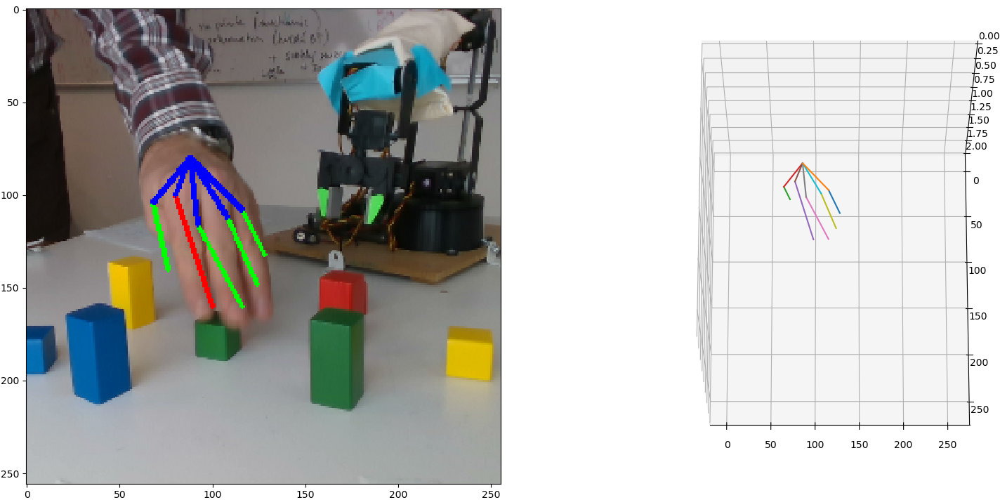
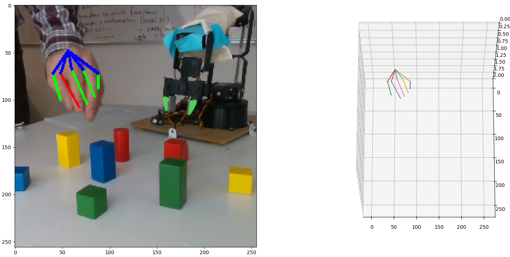
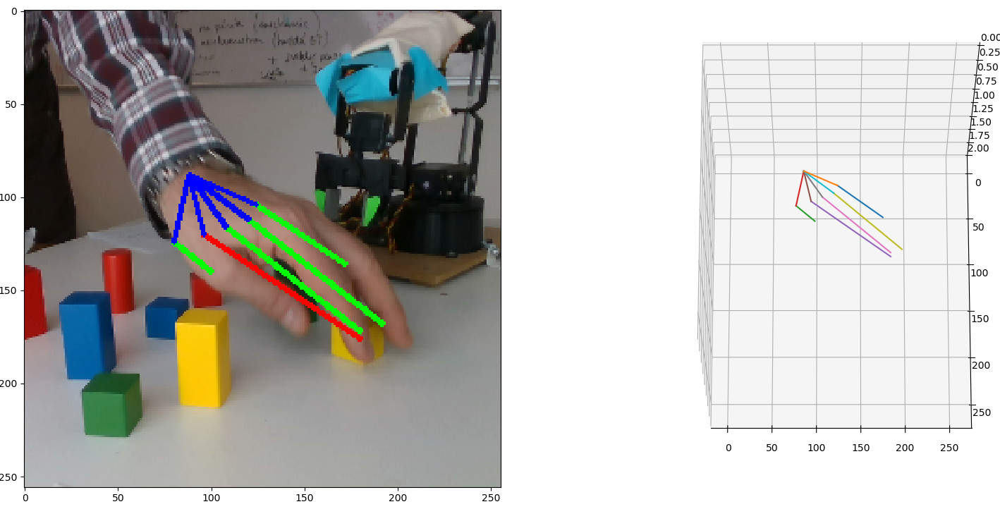
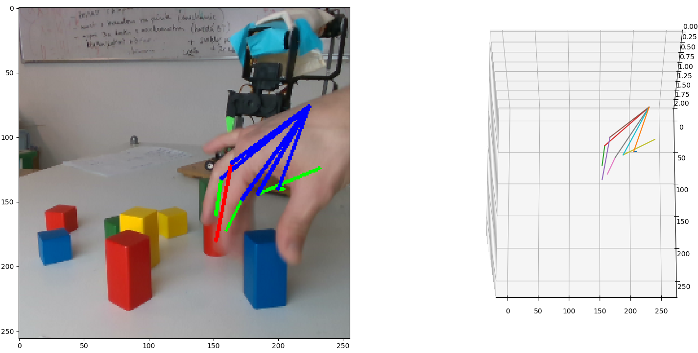

## Detekcia 3D pózy ruky zo stereoskopického záznamu

Spoľahlivá  detekcia  3D  pózy  ruky  je  dôležitým  predpokladom  pre  mnohé aplikačné oblasti. Jednou z nich interakcia ľudského učiteľa s robotom. Cieľom tejto  práce  je  navrhnúť  a  implementovať  vhodnú  metódu  pre  tento  účel za využitia RGB stereozáznamu.

### Ciele

1. Spracovanie prehľadu súčasných možností detekcie 3D pózy ruky z RGB obrazu s využitím jednej a viacerych kamier.
2.  Porovnanie  vybraných  metód  pre  aplikačnú  oblasť  interakcie  robota s ľudským učiteľom.
3. Implementácia a vyhodnotenie systému na detekciu 3D pózy ruky učiteľa zo stereoskopického záznamu.

### Prezentácia

Prezentácia práce [[PDF]](https://github.com/bordac6/DiplomovaPraca/blob/master/Presentation/Detekcia%203D%20p%C3%B3zy%20ruky%20zo%20stereoskopick%C3%A9ho%20z%C3%A1znamu.pdf)

### Dokumentácia

Dokumentácia práce [[PDF]](https://github.com/bordac6/DiplomovaPraca/blob/master/TomasBordac.pdf)

### Zdrojový kód

HandPoseEstimation [[Project]](https://github.com/bordac6/hand3d)

### Podobne prace

- 3D hourglas [[PDF]](http://bmvc2018.org/contents/papers/1133.pdf)
- ColorHandPose3D network [[Project]](https://github.com/lmb-freiburg/hand3d)
- Dynamic Based 3D skeletal Hand Tracking [[PDF]](https://arxiv.org/pdf/1705.07640.pdf)
- hand detection and tracking [[PDF]](http://openaccess.thecvf.com/content_ECCV_2018/papers/Xiaokun_Wu_HandMap_Robust_Hand_ECCV_2018_paper.pdf) [[Project]](https://xkunwu.github.io/projects/hand-track/hand-track)
- Efficient Tracking of the 3D Articulated Motion of Human Hands. [[PDF]](http://users.ics.forth.gr/~oikonom/pb/oikonomidisPhDthesis.pdf)
- GANerated Hands for Real-Time 3D Hand Tracking from Monocular RGB. [[PDF]](http://handtracker.mpi-inf.mpg.de/projects/GANeratedHands/content/GANeratedHands_CVPR2018.pdf) [[Project]](http://handtracker.mpi-inf.mpg.de/projects/GANeratedHands/)
- Vision-based hand pose estimatino [[Project]](https://dr.ntu.edu.sg/handle/10356/65842)
- Real-Time Continuous Pose Recovery of Human Hands Using Convolutional Networks [[PDF]](https://cims.nyu.edu/~tompson/others/TOG_2014_paper_PREPRINT.pdf)
- SO-HandNet: Self-Organizing Network for 3D Hand Pose Estimation with Semi-supervised Learning [[PDF]](https://drive.google.com/file/d/11GJzouV6jt_aOpvrJ8l3J5x_R_-m-Lg8/view)[[Project]](https://github.com/TerenceCYJ/SO-HandNet)

### Implementacne zdroje 
- Intel Real Sense [[Git]](https://github.com/IntelRealSense/hand_tracking_samples) [[Intel]](https://dev.intelrealsense.com/docs/code-samples?_ga=2.205128336.1241596958.1570466579-2098720125.1570466579)
- IntelRealSense SDK [[Git]](https://github.com/IntelRealSense/librealsense/releases)

### Tyzdennik

#### September 30, 2019	October 6, 2019
- Navrh postupu pri praci.
1. spracovanie vystupu z kameri Intel Real Sense d350i
2. vytvorit trenovaciu mnozinu pomocou existujucej CNN na najdenie ruky z kameri v 1. bode (RGB + depth_map)
3. vytvorit vlastnu CNN a pomocou spracovanych dat z bodu 2. natrenovat na 2D obrazkoch

#### October 7, 2019	October 13, 2019
- Zbieranie informacii o novej kamere, ktora bude pouzita pri praci.
- Existujuce [projekty](https://github.com/IntelRealSense/hand_tracking_samples) na najdenie ruky pouzitim kameri Intel Real Sense

#### October 14, 2019	October 20, 2019
- Ulozenie videa z kameri Intel RealSense D435i
- Prestudovanie hand_tracking_samples projektu, kompilovanie a spustenie

#### October 21, 2019	October 27, 2019
- Existujuci [projekt](https://github.com/limgm/hand_tracking_samples_D400) upraveny na nove SDK2.0 a kamery radu D400

#### October 28, 2019	November 3, 2019
- Priprava prezentacie:
  - popis [hardweru](https://www.intel.com/content/dam/support/us/en/documents/emerging-technologies/intel-realsense-technology/Intel-RealSense-D400-Series-Datasheet.pdf) a [vstupnych dat](http://wiki.ros.org/Bags/Format/2.0)
  - existujuce vychodzie metody
  - navrh implementacie prace

#### November 4, 2019	November 10, 2019
- preštudovanie a implementiacia sample projektu [NuiTrack](https://nuitrack.com/)

#### November 11, 2019	November 17, 2019
- spísanie teórie o CNN pre dokumentáciu práce
- vytvorenie basic CNN

#### November 18, 2019	November 24, 2019
- Estimation on 2D [[Project]](https://github.com/lmb-freiburg/freihand)[[Dataset]](https://lmb.informatik.uni-freiburg.de/resources/datasets/FreihandDataset.en.html)

#### November 25, 2019	December 1, 2019
- preštudovanie a spísanie podobnej práce, ktorá používa RGB-D bez CNN (Dynamic Based 3D skeletal Hand Tracking)

#### December 2, 2019	December 8, 2019
- preštudovanie a spísanie podobnej práce, ktorá používa RGB, syntetický model a CNN (GANerated Hands for Real-Time 3D Hand Tracking from Monocular RGB)

#### December 9, 2019	December 15, 2019
- preštudovanie ako funguje architektúra neurónovej siete [hourglass](https://arxiv.org/abs/1603.06937)

#### December 16, 2019	December 22, 2019
